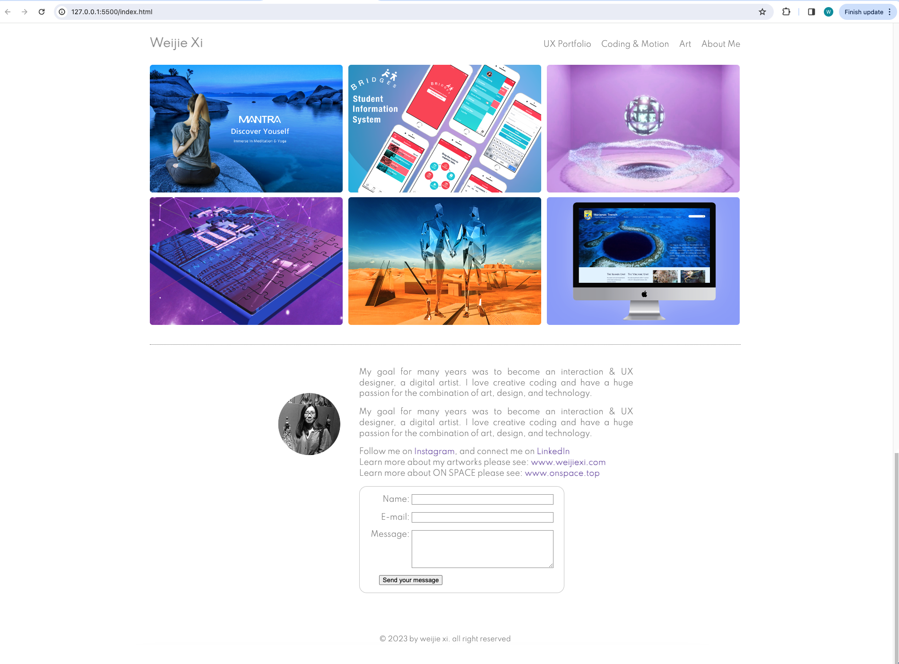
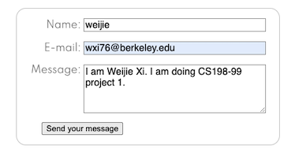

# Project 1: Personal website

✨ Website deploy: [weijiexi.art](https://weijiexi.art/)

## Part 1: HTML

There are three main parts to this project:
1. index.html
2. main.css
3. main.js

### Tags used

- The essential HTML (text) tags used:
  - h1, h2, p, b, i, sub, sup, br, etc.
  - Creating bulleted lists using `<ul>`, `<ol>`, and `<li>` tags
- Embedding an image in the webpage using ``. Alternate text prop
- Linking to different pages - 1 live page and 1 local page (`<a>` tag).
- Creating a basic form on the local page.
- A button that reloads the page.
- Basic info about meta tags.

### Skeleton Code in `index.html`

Begin with `<!DOCTYPE html>`, and include `<html>`, `<head>` and `<body>` tags.

### Title, Heading

A title to tell the readers what they will be reading about

- Give the webpage a title -` Weijie Xi' Website & Portfolio`.
- Give the webpage a heading. `<h2 class="logo">Weijie Xi</h2>`.

Notice how the heading and title are different

### Content

The main page looks like this:



### Links used

-   Follow me on [Instagram](https://www.instagram.com/weijie_xi), and connect me on [LinkedIn](https://www.linkedin.com/in/weijie-xi-76469a27a/)
-   Learn more about my artworks please see: [www.weijiexi.com](https://www.linkedin.com/in/weijie-xi-76469a27a/)
-   Learn more about ON SPACE please see: [www.onspace.top](http://127.0.0.1:5500/www.onspace.top)

### Another page!

Create another page `UX_Portfolio.html`. Then, link to it from main page using the `<a>` tag. 

```html 

  <nav>
    <ul class="main-nav">
        <li><a href="UX_Portfolio.html">UX Portfolio</a></li>
        <li><a href="#">Coding &amp; Motion</a></li>
        <li><a href="#">Art</a></li>
        <li><a href="#">About Me</a></li>
    </ul>
  </nav>
```

### Image

Insert images into the site (or multiple!). Link to the image from the `img` tag.

### Form

Using the `form` and `input` tags, create a form that accepts some data, and create a submit button.



### Metadata

The `<meta>` tag defines metadata about an HTML document. Metadata is data (information) about data.

```html
  <head>
      <meta charset="UTF-8">
      <title>Weijie Xi' Website & Portfolio</title>
      <meta name="Author" content="Weijie Xi"/>
      <link rel="stylesheet" type="text/css" href="main.css">
      <meta name="viewport" content="width=device-width, initial-scale=1.0">
      <meta name="description" content="This is Weijie's website & Portfolio.">
      <link href="https://fonts.googleapis.com/css2?family=Spartan:wght@300&display=swap" rel="stylesheet">
  </head>
```

## Part 2: CSS

CSS make my personal website pretty.

### Elements styled

- Selectors, id vs. class
- Basic properties of CSS (text, background, boroder, colors)
- Margin, and Padding
- Position property
- Display inline vs. block
- Flexbox (display flex)
- Transform and transition

## Part 3: JavaScript

To make my personal website more interactive, I use JavaScript to add some functionality. 

- index.js

### Functionality accomplished

- Getting elements from the HTML document
- Changing innerHTML and css properties
- Event listeners
- Arrow functions & callbacks
- Promises & fetch

## Part 4: SSR

Create a server that will serve HTML website. 

### Functionality accomplished by the server

- Configuring a web server
- Serving HTML files on multiple paths
- Serving CSS and JS files
- Using templating strategies to serve dynamic content
- Persisting data in files
- Reading and sending cookies

